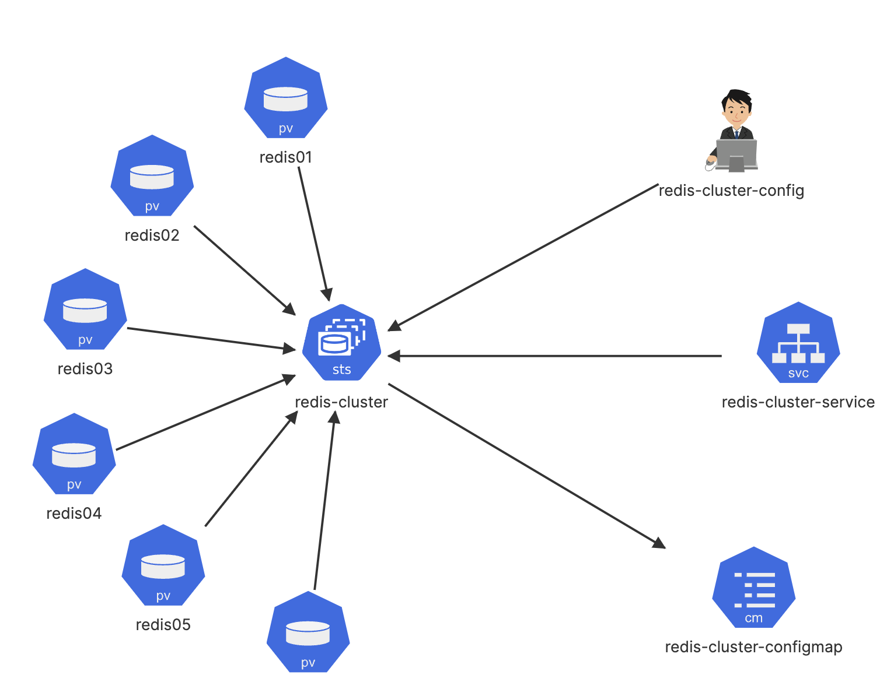

# Redis Cluster



**1. Clone Repository:** Clone this repository to your local machine using the
following command:

```bash
git clone https://github.com/kiran-machineni/kubernetes-examples
```

**2. Apply Kubernetes Configurations:**

- Navigate to the folder containing Kubernetes configuration files.

```bash
cd kubernetes-examples
```

- Use kubectl apply command to apply the manifests to your Kubernetes cluster:

```bash
kubectl apply -f ./redis-cluster
```

**3. Create Redis cluster:**

Execute below command in terminal to create redis cluster

```bash
kubectl exec -it redis-cluster-0 -- redis-cli --cluster create --cluster-replicas 1 $(kubectl get pods -l app=redis-cluster -o jsonpath='{range.items[*]}{.status.podIP}:6379 {end}')
```

**4. Test Redis Cluster:**

- You can access the Redis cluster using any tool or client that supports Redis.
  The most common tool is redis-cli, which is a command-line client for Redis.

- You can connect to any Redis node within the cluster. Typically, you connect
  to the node with the primary Redis master, which is redis-cluster-0

- Once connected, you can perform various operations to test the Redis cluster's
  functionality. Some common operations include setting keys, getting values,
  and testing replication.

```bash
# Connect to the Redis master node (redis-cluster-0)
kubectl exec -it redis-cluster-0 -- redis-cli

# Set a key-value pair
127.0.0.1:6379> SET testkey "Hello, Redis!"

# Retrieve the value
127.0.0.1:6379> GET testkey

# Output should be "Hello, Redis!"

# Test replication by checking keys on other nodes
127.0.0.1:6379> KEYS *

```
